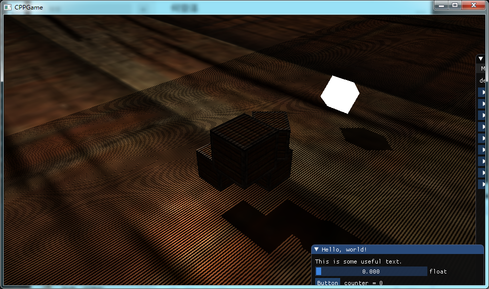

# CPPGame
1.语言：C++

2.图形API：openGL

3.图形API扩展库：glew+glad

4.数学库：glm

5.图片加载库：soil

6.字体引擎：free type

7.模型加载库：cocos 的 objLoader类

8.参考

  https://zhuanlan.zhihu.com/c_119702958

  https://learnopengl-cn.github.io/

9.C++ 包管理器 vcpkg,下载源码,编译源码太慢太慢太慢

```
1.cjson
2.glm
3.glad
4.glfw
5.qt5
6.freetype
7.imgui
```

10.当前效果

